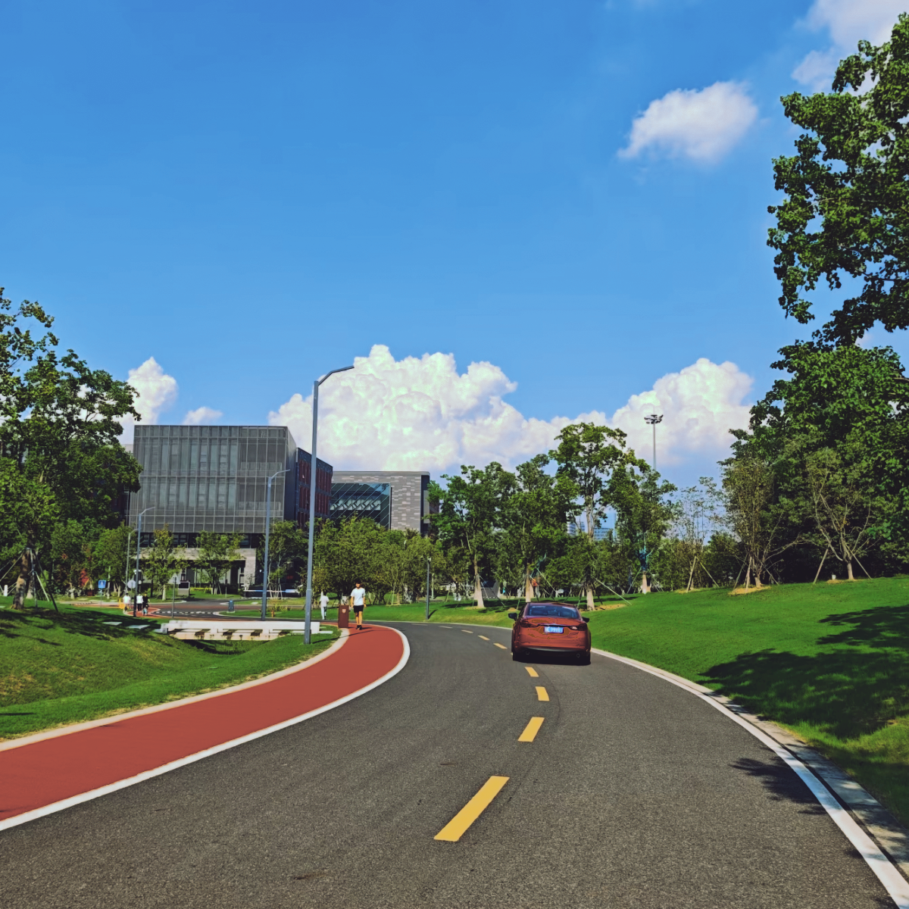

# 作业1 
代码如下：
```python
import torch
from PIL import Image
import numpy as np

def poly_features(rgb):
    r, g, b = rgb[..., 0], rgb[..., 1], rgb[..., 2]
    feats = [
        torch.ones_like(r), r, g, b,
        r * r, g * g, b * b,
        r * g, r * b, g * b,
        r * g * b
    ]
    return torch.stack(feats, dim=-1) 

def load_image(path):
    img = Image.open(path).convert("RGB")
    arr = np.asarray(img).astype(np.float32) / 255.0
    return torch.from_numpy(arr)

def train(X, Y, lam=1e-6):
    # X: (N, 11), Y: (N, 3)
    XT = X.T
    A = XT @ X
    I = torch.eye(A.shape[0])
    W = torch.linalg.inv(A + lam * I) @ XT @ Y
    return W  # (11, 3)

def apply(W, img):
    feats = poly_features(img)
    out = feats @ W
    out = out.clamp(0, 1)
    return out

if __name__ == "__main__":
    # 训练集
    src = load_image("homework1/input.png")   # 输入图
    tgt = load_image("homework1/output.png")  # 目标图

    X = poly_features(src).reshape(-1, 11)
    Y = tgt.reshape(-1, 3)
    W = train(X, Y)

    # 在测试图像上应用
    test = load_image("homework1/test.png")
    pred = apply(W, test)

    # 保存结果
    pred_img = (pred.numpy() * 255).astype(np.uint8)
    Image.fromarray(pred_img).save("homework1/test_output1.png")
```
测试结果如下：
